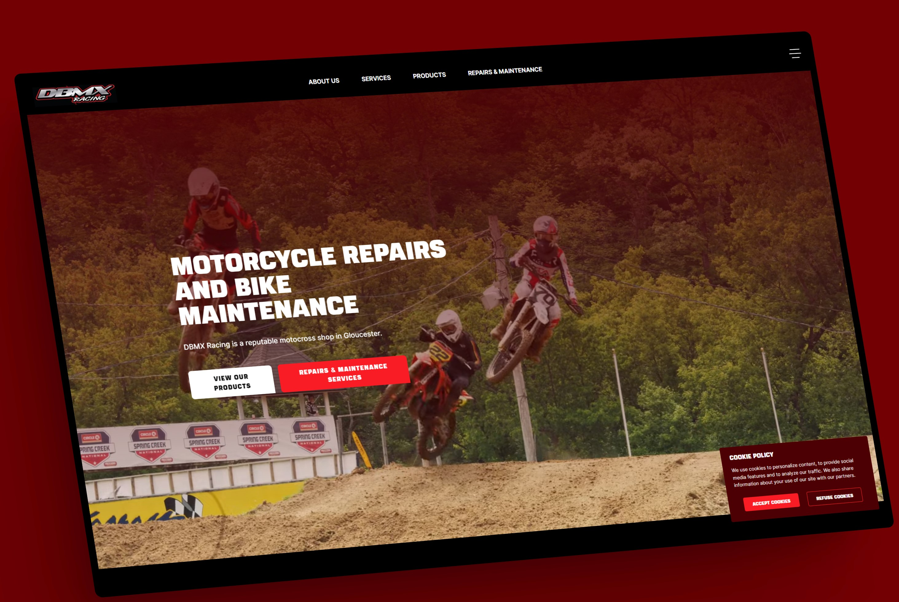

## Project Description

1. All images are in 4K resolution, click to enlarge for better viewing.

# Project Context
This is a Next.js 13 project website I've built for a Motocross accessories and parts local business. A Typescript based project using nextjs 13 static side rendering. This projects is developed solely with Next.js 13 - featuring, Typescript, Javascript, React 18, Tailwind, and a Headless Wordpress CMS API

1. Develop a website using Next.js framework.
2. Show my ability to develope a headless-CMS, jamstack, Server Side Rendering & Firebase backend web application.

# My Objective
To further learn Firebase backen, fire cloud storage and Next.js 13 framework.

# Deployment

Deployed with vercel here: 

a). https://dbmx-racing.vercel.app/
